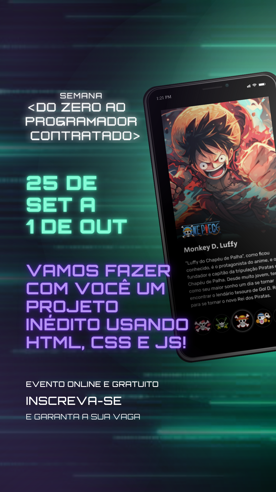

# projeto DevEmDobro - semana DO ZERO AO PROGRAMADOR CONTRATADO
Projeto desenvolvido na semana DO ZERO AO PROGRAMADOR CONTRATADO
  
<a href="https://www.youtube.com/watch?v=mNZ9Xd4cEbM&t=3511s&ab_channel=DevemDobro" target="_blank">Link Aulas</a>
  
##Projeto inspirado no anime "One Piece"
  

  

